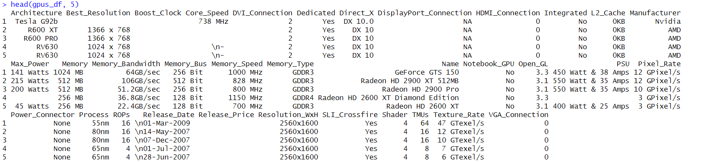
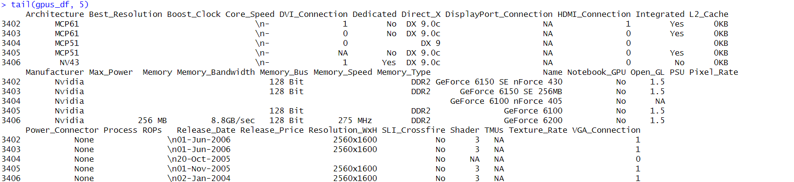
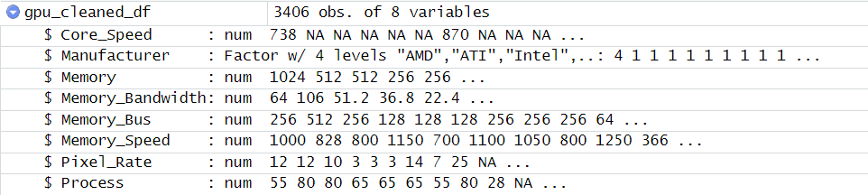
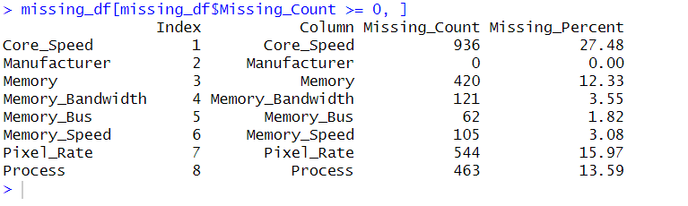
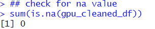
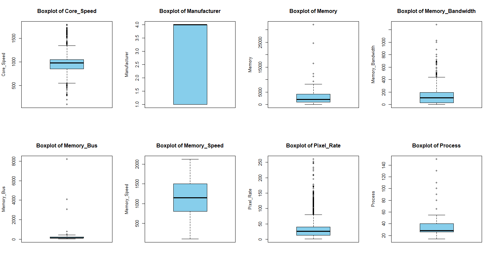
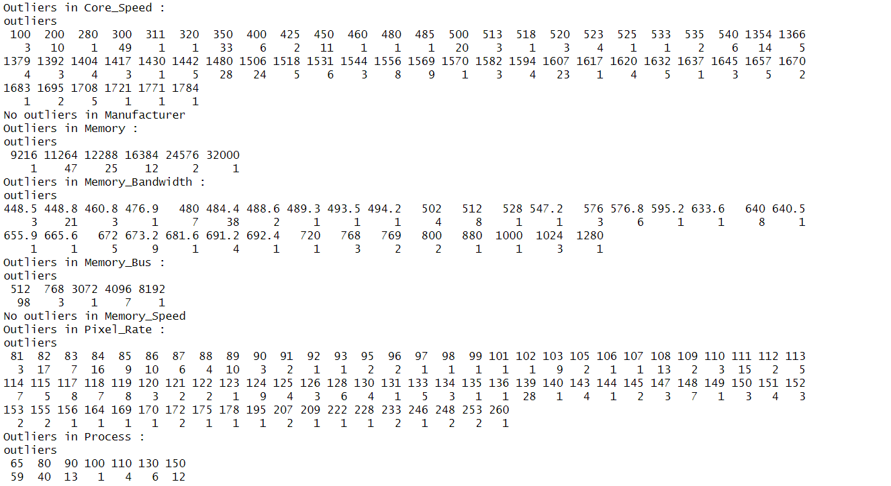
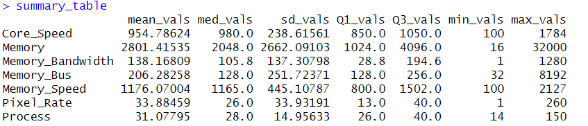
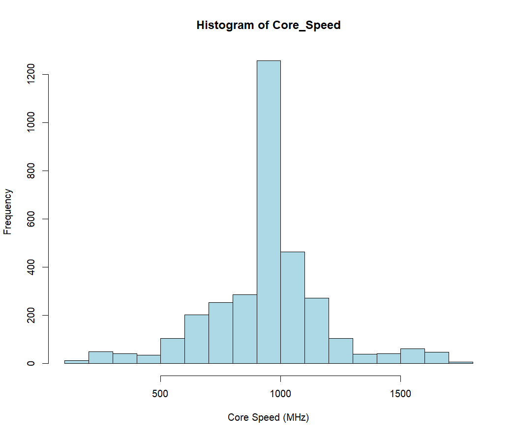

# SP_Assignment

## Set up Environment
[Set up R in VS Code](https://youtu.be/x4b46DzclzY?si=az7ZaxD1WQD993lD)


## 1. Tiền xử lý dữ liệu

### 1.1 Mục tiêu  
- Chuẩn hoá định dạng thô, loại bỏ ký tự không mong muốn  
- Xác định và thay thế các giá trị thiếu (NA)  
- Chuyển các trường từ chuỗi có đơn vị sang kiểu số để phục vụ phân tích  

### 1.2 Phương pháp
#### Bước 1: Đọc dữ liệu gốc và quan sát   
```r
raw_file_path <- "./All_GPUs.csv"
gpus_df <- read.csv(raw_file_path, stringsAsFactors = FALSE)
```


*Hình 1: Kết quả đọc dữ liệu từ file csv (Bao gồm 3406 quan sát, 34 biến)*

```r
head(gpus_df, 5)
```


*Hình 2: Kết quả đọc dữ liệu 5 dòng đầu của tập dữ liệu*

```r
tail(gpus_df, 5)
```


*Hình 3: Kết quả đọc dữ liệu 5 dòng cuối của tập dữ liệu*

Quan sát qua 5 dòng đầu và 5 dòng cuối cho thấy:

* Có những ô chứa ký tự “\n” (xuống dòng) hoặc “\r” lẫn trong nội dung.

* Một số ô chứa dấu gạch ngang “-” hoặc khoảng trắng đơn lẻ thể hiện giá trị thiếu.

**Kết luận:** Dữ liệu gốc có nhiều ô thiếu và định dạng chưa đồng nhất. Tiếp theo, chúng ta sẽ áp dụng **bước tiền xử lý** để:

* Loại bỏ ký tự xuống dòng và khoảng trắng thừa.

* Chuẩn hóa giá trị thiếu (thay “-” hoặc chuỗi trống thành NA).

#### Bước 2: Chuẩn hóa định dạng
```r
# 2.1 Loại bỏ ký tự xuống dòng
gpu_formatted_df <- gpus_df
gpu_formatted_df[] <- lapply(gpu_formatted_df, function(column) {
gsub("[\r\n]+", "", column)
})

# 2.2 Thay giá trị “–” hoặc chuỗi rỗng thành NA
gpu_formatted_df[] <- lapply(gpu_formatted_df, function(column) {
ifelse(grepl("^\\s*-\\s*$|^\\s*$", column), NA, column)
})

# 2.3 Xóa khoảng trắng đầu – cuối
gpu_formatted_df[] <- lapply(gpu_formatted_df, function(column) {
trimws(column)
})

# 2.4 Ghi ra file đã format
formatted_file_path <- "./All_GPUs_formatted.csv"
write.csv(gpu_formatted_df, formatted_file_path, row.names = FALSE)
```

**Kết quả**

* File `All_GPUs_formatted.csv` chứa dữ liệu đã được chuẩn hoá:

* Không còn xuống dòng/chữ thừa
* Các chỗ thiếu được đánh dấu NA

#### Bước 3: Chọn cột & chuyển kiểu

Chỉ giữ các biến cần phân tích, đồng thời chuyển chuỗi (char) chứa đơn vị về số (numeric):

```r
# 3.1 Chọn các cột tương ứng với các biến cần phân tích
selected_columns <- c(
  "Core_Speed", "Manufacturer", "Memory",
  "Memory_Bandwidth", "Memory_Bus", "Memory_Speed", 
  "Pixel_Rate", "Process"
)
gpu_cleaned_df <- gpu_formatted_df[, selected_columns]

# 3.2 Chuyển các biến sang kiểu số
numeric_columns <- setdiff(selected_columns, "Manufacturer")
for (col in numeric_columns) {
  gpu_cleaned_df[[col]] <- as.numeric(gsub("[^0-9.]", "", gpu_cleaned_df[[col]]))
}

# 3.3 Chuyển Manufacturer thành factor
gpu_cleaned_df$Manufacturer <- factor(gpu_cleaned_df$Manufacturer)
```


*Hình 4: Kết quả sau khi thực hiện xong bước 3*

#### Bước 4: Xử lý giá trị thiếu & ngoại lệ
```r
# 4.1 Xem tỷ lệ các giá trị thiếu trong tập dữ liệu
missing_values <- colSums(is.na(gpu_cleaned_df))
missing_df <- data.frame(
  Index = seq_along(missing_values),
  Column = names(missing_values),
  Missing_Count = as.vector(missing_values),
  Missing_Percent = round(100 * missing_values / nrow(gpu_formatted_df), 2)
)
missing_df[missing_df$Missing_Count >= 0, ]
```


*Hình 5: Tỷ lệ dữ liệu bị thiếu trong từng biến*

**Nhận xét:** Tỷ lệ dữ liệu bị thiếu trong tập dữ liệu khá lớn. Vì vậy, đối với các biến có lượng dữ liệu bị thiếu nhiều (**core_speed, memory, pixel_rate, processs**), nhóm sẽ thực hiện phương pháp thay thế các giá trị thiếu bằng các giá trị trung vị (median).

```r
# 4.2 Thay thế dữ liệu thiếu bằng trung vị
median_core_speed <- median(gpu_cleaned_df$Core_Speed, na.rm = TRUE)
gpu_cleaned_df$Core_Speed[is.na(gpu_cleaned_df$Core_Speed)] <- median_core_speed

median_memory <- median(gpu_cleaned_df$Memory, na.rm = TRUE)
gpu_cleaned_df$Memory[is.na(gpu_cleaned_df$Memory)] <- median_memory

median_pixel_rate <- median(gpu_cleaned_df$Pixel_Rate, na.rm = TRUE)
gpu_cleaned_df$Pixel_Rate[is.na(gpu_cleaned_df$Pixel_Rate)] <- median_pixel_rate

median_process <- median(gpu_cleaned_df$Process, na.rm = TRUE)
gpu_cleaned_df$Process[is.na(gpu_cleaned_df$Process)] <- median_pixel_rate

# 4.3 Xóa các dòng chứa các giá trị thiếu còn lại
gpu_cleaned_df <- gpu_cleaned_df[complete.cases(gpu_cleaned_df), ]
sum(is.na(gpu_cleaned_df))
```


*Hình 6: Không còn dữ liệu thiếu trong tập dữ liệu*

```r
# 4.4 Vẽ boxplot để thể hiện các outlier và tìm các outlier có trong từng biến
par(mfrow = c(2, 4)) plots

find_boxplot_outliers <- function(data, column_name) {
  col_data <- data[[column_name]]
  outliers <- boxplot.stats(col_data)$out  
  
  if (length(outliers) > 0) {
    outlier_counts <- table(outliers)  
    cat("Outliers in", column_name, ":\n")
    print(outlier_counts)
  } else {
    cat("No outliers in", column_name, "\n")
  }
}

for (col in selected_columns) {
  boxplot(gpu_cleaned_df[[col]], 
          main = paste("Boxplot of", col), 
          ylab = col, 
          col = "skyblue", 
          border = "black")
  find_boxplot_outliers(gpu_cleaned_df, col)
}
```


*Hình 6: Boxplot của các biến trong tập dữ liệu*



*Hình 7: Outlier của từng biến*

**Nhận xét:** Qua phân tích boxplot, đa số giá trị ngoại lai (outlier) đều nằm trong giới hạn hợp lý của thông số GPU: các mức Core_Speed rất thấp (< 500 MHz) thuộc GPU tích hợp hoặc cũ, và các mức rất cao (> 1 300 MHz) phản ánh GPU rời high-end; Memory từ 9 GB đến 32 GB, Memory_Bandwidth lên đến hơn 1 000 GB/s nhờ HBM3, Pixel_Rate trong khoảng 80–260 GPixel/s, và Process từ 65–150 nm đều là những thông số thực tế. Chỉ có Memory_Bus = 3072 bit là bất hợp lý, vì không tồn tại chuẩn bus 3 072 bit trên GPU thương mại; do đó giá trị này sẽ được loại bỏ để đảm bảo tính chính xác và nhất quán cho các phân tích sau.

```r
# 4.5 Loại bỏ outlier không hợp lý (Memory_Bus = 3072)
gpu_cleaned_df <- gpu_cleaned_df[gpu_cleaned_df$Memory_Bus != 3072, ]
```


## 2. Thống kê mô tả

### 2.1 Mục tiêu

* Cung cấp các chỉ số cơ bản (trung bình, trung vị, độ lệch chuẩn, min, max, Q1, Q3) cho các biến số chính.  
* Khảo sát phân phối của biến `Core_Speed`.  
* So sánh phân phối `Core_Speed` giữa các nhà sản xuất.  
* Xem xét mối quan hệ giữa `Core_Speed` và các biến phụ: `Memory`, `Pixel_Rate`, `Memory_Bandwidth`, `Memory_Bus`, `Memory_Speed`, `Process`.


### 2.2 Phương pháp

#### Bước 1: Tính bảng thống kê mẫu cho các cột numeric:  

```r
numeric_columns <- sapply(gpu_cleaned_df[, selected_columns], is.numeric)

mean_vals <- apply(gpu_cleaned_df[, numeric_columns], 2, mean)
med_vals  <- apply(gpu_cleaned_df[, numeric_columns], 2, median)
sd_vals   <- apply(gpu_cleaned_df[, numeric_columns], 2, sd)
Q1_vals   <- apply(gpu_cleaned_df[, numeric_columns], 2, quantile, probs = 0.25)
Q3_vals   <- apply(gpu_cleaned_df[, numeric_columns], 2, quantile, probs = 0.75)
min_vals  <- apply(gpu_cleaned_df[, numeric_columns], 2, min)
max_vals  <- apply(gpu_cleaned_df[, numeric_columns], 2, max)

summary_table <- data.frame(mean_vals, med_vals, sd_vals, Q1_vals, Q3_vals, min_vals, max_vals)
summary_table
```


*Hình 8: Kết quả thống kê mẫu dạng bảng*

#### Bước 2: Histogram của Core_Speed.  

```r
hist(gpu_cleaned_df$Core_Speed,
     main = "Histogram of Core_Speed",
     xlab = "Core Speed (MHz)",
     col = "lightblue",
     border = "black")
```


*Hình 9: Biểu đồ Histogram của biến Core_speed*

**Nhận xét:**
* **Hình dạng chung:** Biểu đồ chỉ ra một đỉnh phân phối duy nhất nằm quanh khoảng 900–1100 MHz, cho thấy phần lớn GPU có core clock tập trung trong vùng này.
* **Tính đối xứng và độ lệch:** 
  * Đỉnh cao nhất rơi vào khoảng 950–1000 MHz, sát với trung vị (~980 MHz).
  * Histogram hơi lệch trái: có một số giá trị rất thấp (100–300 MHz) kéo trung bình xuống dưới trung vị.
  * Đuôi phải kéo dài tới hơn 1 700 MHz, đại diện cho các GPU high-end với xung rất cao nhưng tần suất rất thấp.
  * Tuy nhiên, sự lệch không quá lớn, phân phối vẫn tương đối cân bằng quanh trung tâm.
* **So sánh với phân phối chuẩn:** Về tổng thể, phân phối Core_Speed có hình dạng tương tự đường cong Gaussian, nhưng lại lệch trái. Mặc dù phần lớn dữ liệu tập trung quanh trung tâm (như phân phối chuẩn), vẫn có nhiều giá trị “xa trung tâm” hơn một chút.

#### Bước 3: Boxplot mối quan hệ giữa Core_speed và Manufacture.  
```r
boxplot(Core_Speed ~ Manufacturer,
        data = gpu_cleaned_df,
        main = "Core_Speed by Manufacturer",
        ylab = "Core Speed (MHz)",
        xlab = "Manufacturer",
        col = "lightgreen",
        border = "black"
)
```


*Hình 9: Biểu đồ Histogram của biến Core_speed*

**Nhận xét:**
* **Hình dạng chung:** Biểu đồ chỉ ra một đỉnh phân phối duy nhất nằm quanh khoảng 900–1100 MHz, cho thấy phần lớn GPU có core clock tập trung trong vùng này.
* **Tính đối xứng và độ lệch:** 
  * Đỉnh cao nhất rơi vào khoảng 950–1000 MHz, sát với trung vị (~980 MHz).
  * Histogram hơi lệch trái: có một số giá trị rất thấp (100–300 MHz) kéo trung bình xuống dưới trung vị.
  * Đuôi phải kéo dài tới hơn 1 700 MHz, đại diện cho các GPU high-end với xung rất cao nhưng tần suất rất thấp.
  * Tuy nhiên, sự lệch không quá lớn, phân phối vẫn tương đối cân bằng quanh trung tâm.
* **So sánh với phân phối chuẩn:** Về tổng thể, phân phối Core_Speed có hình dạng tương tự đường cong Gaussian, nhưng lại lệch trái. Mặc dù phần lớn dữ liệu tập trung quanh trung tâm (như phân phối chuẩn), vẫn có nhiều giá trị “xa trung tâm” hơn một chút.

#### Bước 2: Boxplot mối quan hệ giữa Core_speed và Manufacture.  

